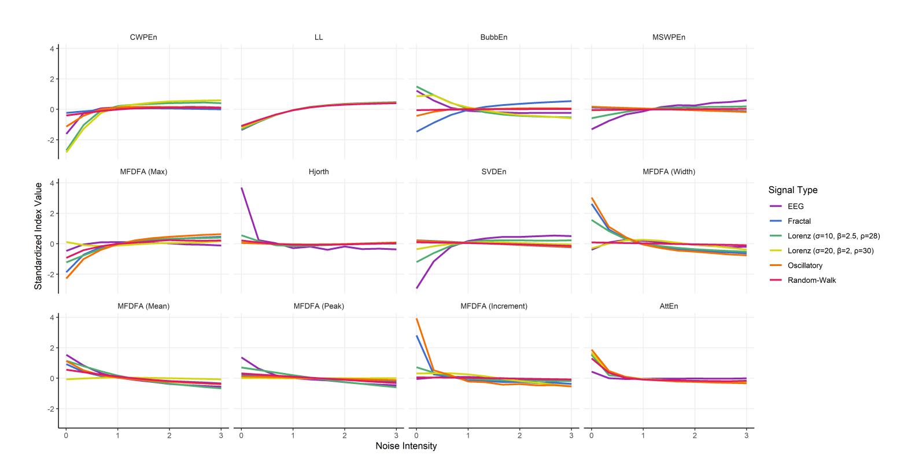

---
authors:
- Stephanie-Kirk
categories:
- Complexity Science
- EEG
- Psychology
- Neurokit2
- Neurophysiology
date: "2022-08-30"
draft: false
featured: false
image:
  caption: ''
  placement: 0
title: "Structure of Chaos "
subtitle: 'An Empirical Comparison of Fractal Physiology Complexity Indices Using NeuroKit2'
summary: 'An Empirical Comparison of Fractal Physiology Complexity Indices Using NeuroKit2'
tags:
- NeuroKit2
- Python
- Complexity Science
- Nonlinear Dynamics
- Fractal
- Sphinx
- Documentation
- Neurophysiology
- Psychology
---

## Our most recent publication is now out in *Entropy* 

Given the increasing use of complexity analysis in quantifying neural activity, and a rapidly growing body of complexity indices, we put [**NeuroKit2 Python Software**](https://neuropsychology.github.io/NeuroKit/) to use, deriving recommendations for indices selection.

We compared the relationship and objective performance of 112 complexity indices based on:
- Computational weight
- Representativeness of a multidimensional space of latent dimensions
- Empirical proximity with other indices

<figure align="center">
    
    <figcaption> A selection of 12 indices, visualized with the expected value according to signal type and amount of noise.</figcaption>
</figure>

We propose a selection of 12 indices, together representing 85.97% of total variance of all indices. The final selection includes *CWPEn, Line Length (LL), BubbEn, MSWPEn, MFDFA (Max), Hjorth Complexity, SVDEn, MFDFA (Width), MFDFA (Mean), MFDFA (Peak), MFDFA (Fluctuation), AttEn.* This study has attempted to empirically map the relationship between indices and provide information which may contribute to furthering reproducibility, replicability and clarity in the field.

For more details, see the the full study:
 [**Structure of Chaos : An Empirical Comparison of Fractal Physiology Complexity Indices Using NeuroKit2!**](https://www.mdpi.com/1099-4300/24/8/1036)

Also, congratulations to [An Shu](https://github.com/anshu-97) 🎉 on her first publication!
