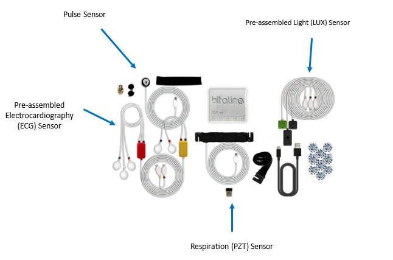
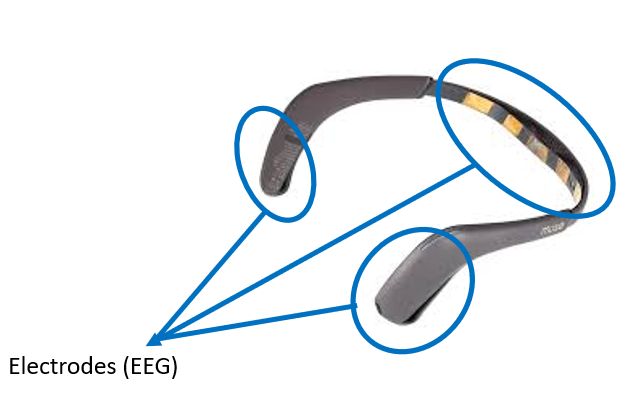
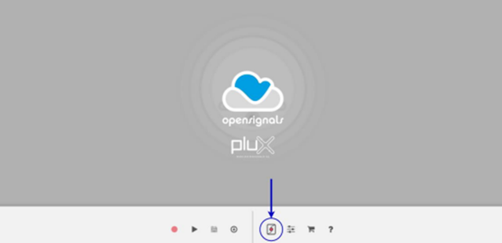
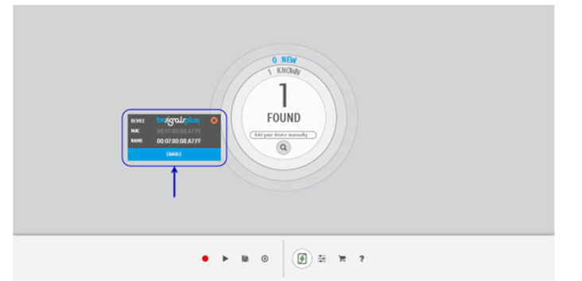
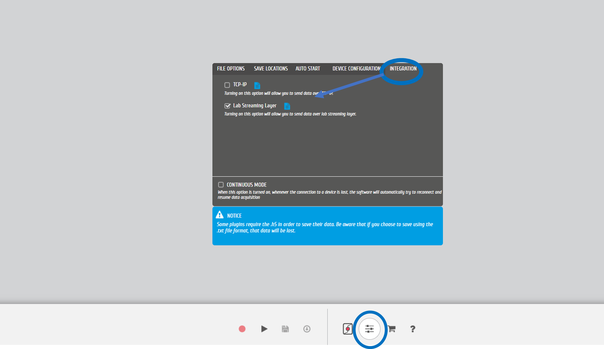
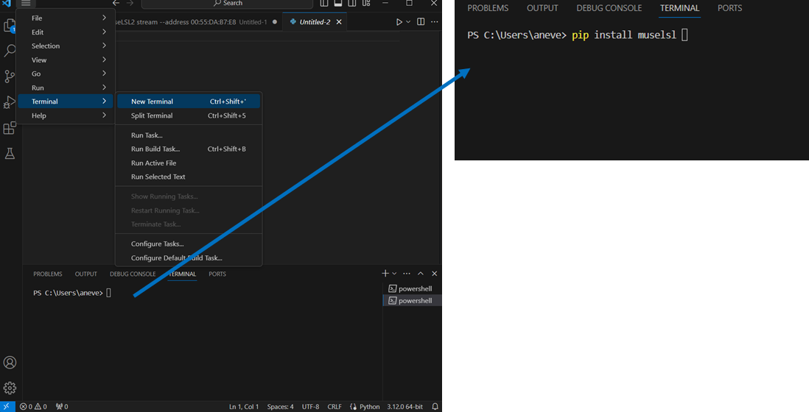
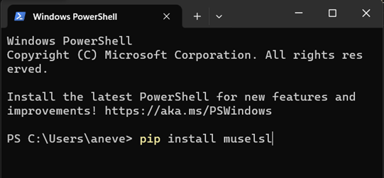

---
authors:
- ana-neves
categories:
- Tutorials
- Biosignals
date: "2023-11-02"
title: "Record and Synchronize biosignals from Bitalino with EEG from Muse"
draft: false
featured: false
image:
  caption: ''
  placement: 0
subtitle: ""
summary: "A step-by-step guide on how to stream, record, and synchronize physiological signals recorded by Bitalino and Muse 2 EEG headband"
tags:
- Reality Bending Lab
- ReBeL
- University of Sussex
- Psychology
- Neuropsychology
- Physiological
- Psychophysiology
- Muse 2 EEG
- Bitalino
- Plux
- Psychobit
- LSL
- Lab Streaming Layer
- Synchronize
- Send triggers
---

## Equipment

The setup used here is a low cost (< 1000€), easy-to-setup solution for comprehensive bodily recordings with a bit of EEG.

### Bitalino

- Record bodily signals (ECG, PPG, RSP, EDA, ...)
- 420€
- [Official website](https://www.pluxbiosignals.com/products/psychobit)

### Muse 2 EEG Headset

- Record PPG and 4 EEG channels (TP9, TP10, AF7, AF8)
- 269.99€
- [Official website](https://eu.choosemuse.com/products/muse-2)

## Software

The following software is needed to collect, record and analyse physiological data.

**Open Signals**: used to visualise the signals recorded from BItalino.

1. Download OpenSignals (r)evolution here: https://biosignalsplux.com/index.php/software
2. Open device manager to access and configure your biosignalsplux device

3. Select advise intended to use.

4. Access the settings by clicking on the biosignalsplux. Select the channel to which the sensors are connected to.

- *add screenshot*
(A1) – respiration belt
(A2) – ECG electrodes
(A3) – Photosensor/ LUX
(A4) -  Pulse sensor

5.  Go to Open signals settings, then the integration tab and click on the lab streaming layer.

6. Start recording.

-*add screenshot of how the signals look

**Python**

1. Download here:  https://www.python.org/downloads/
2. IMPORTANT!!! Make sure to click on 'Add python.exe to PATH' at the bottom.

**VS Code**: code editor for python.

1. Download here: https://code.visualstudio.com/download

MUSE LSL: python package to stream, visualise, and record EEG data from the Muse 2 headset.

1. Open VS Code, click New Terminal.
2. On the Terminal, write 'pip install muselsl' and press enter.

1. If it does not work, open your computer Terminal, and write 'pip install muselsl' and press enter.

For more information go to: https://github.com/alexandrebarachant/muse-lsl

**Lab Recorder**: it logs all streams on the lab network into a single file, with time synchronization between streams.

For Windows:

> Check if Windowns has the necessary dependencies, especially Visual C++ Runtime Redistributable.

1. Visual C++ Runtime Redistributable

    1. Go to Settings > Apps> Installed apps> and search for 'visual'.

    2. If not installed, go to link https://learn.microsoft.com/en-us/cpp/windows/latest-supported-vc-redist?view=msvc-170#visual-studio-2015-2017-2019-and-2022

    3. Find your windows CPU or processor. Go to Settings > System > About. Look for the System type, it will show your CPU architecture. In the example given, it is a x64-based processor.

    4. Go back to the link above and click on the link for the Visual C++ redistributable package that is supported by your CPU architecture.

    5. Install Visual C++.

2. Install Lab Recorder
   1. Go to link https://github.com/labstreaminglayer/App-LabRecorder/releases
    2. Scroll down to assets. Install the Lab recorder that is supported by your computer.
    3. The file will appear in the file explorer. Click on the LabReporter file and double click on LabRecorder.exe.
    4. Click 'extract all'. Go back to step 3 and follow the same procedure. The second time the LabRecorder.exe is executed the lab recorder will be installed and its ready to go.

## How to record data

 ADD HOW TO STREAM WITH THE MUSE
- ADD HOW TO RECORD WITH THE LAB RECORDER

