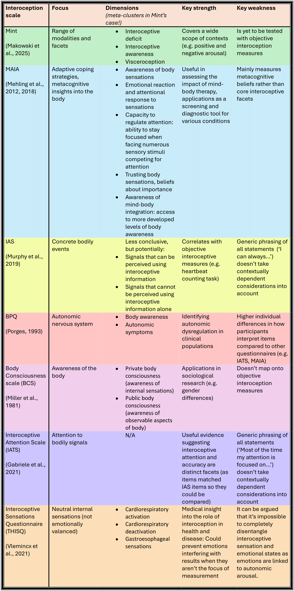

---
authors:
- roisin-sharma
- oliver-collins
categories:
- Reality Bending Lab
date: "2025-09-30"
title: "What is the Best Interoception Scale?"
sbtitle: ""
summary: "Lack of agreement in the world of interoception research has brought us to a standstill! We may have a solution..."
tags:
- Reality Bending Lab
- ReBeL
- University of Sussex
- Psychology
- Interoception
- Mint Scale
- Self-Report Measures
---

Hello👋! We are [Róisín](https://realitybending.github.io/authors/roisin-sharma/) and [Oliver](https://realitybending.github.io/authors/oliver-collins/), two Psychology Placement students at ReBeL 🧙, and today we are going to be discussing the tricky topic of self-reported interoception questionnaires.

**Interoception**, essentially referring to one's sensation of their internal body, has been studied by scientists for over a century (Sherrington, 1906). It is a fundamental phenomenon that we rely on in everyday life, and has been linked to a variety of neurological states including ADHD, personality disorders and anxiety; making it important that we understand it in a broad sense and the various forms it takes. 

However, existing definitions, theoretical considerations, and measures are often at odds with each other. This inconsistent conceptualisation of "interoception" has led to the development of various interoception measures, often based on differing philosophies, raising questions over a "**jingle fallacy**" of interoception scales. In terms of "subjective", self-report scales - the focus of this blog - established measures include the **Multidimensional Assessment of Interoceptive Awareness (MAIA/MAIA-2)**, the **Body Perception Questionnaire (BPQ)**, and the **Interoceptive Accuracy Scale (IAS)**. In this blog we will go through the trials and tribulations of interoceptive measurement, the benefits and pitfalls of these questionnaires and introduce our lab's newly developed interoceptive questionnaire: the **Mint scale**.

When we think of sensation, the 5 that typically come to mind are vision, olfaction, gustation, audition and touch. We call these exteroceptive senses, because they are about sensing external stimuli. This means the source of the sensation is out in the world (as opposed to within the individual's internal state). This is promising for empirical investigation because researchers can directly manipulate external stimuli. This makes objective measurement relatively straight-forward. For example, if I wanted to measure sensation of vision, I could show you an image that flashes on a screen and ask you to say when it appears. This is an objective measure because I can validate your answer by checking if the image was actually on the screen at that point.

On the other hand, the main practical complication to measuring interoception objectively is that it is about internal states. Because interoceptive sensations come from inside the body (e.g., internal organs), it’s harder to compare what you report to your actual state. Naturally, we have some ways to overcome this issue. The main objective measure of interoception looks at cardioception (sensing of the heart) because we can accurately monitor heart rate with electrodes. Namely, the heart beat counting task (HCT) involves comparing when a participant thinks their heart is beating (without feeling their pulse), to when it actually is [(Schandry, 1981)](https://onlinelibrary-wiley-com.sussex.idm.oclc.org/doi/10.1111/j.1469-8986.1981.tb02486.x). This method comes with several drawbacks of its own, and while some other objective interoceptive methods exist, these are in their early stages of usage. In short, more work needs to be done. For now, we remain largely reliant on subective questionnaires to measure interoception. 

However, measuring interoception via self-report has many practical obstacles of its own. As you'd expect when relying on a participant to relay their sensory experience, there's an abundance of within-participant effects to be wary of. There's the typical culprits: participants may understand items differently, or struggle to interpret them if it's about an interoceptive process they struggle with. A particular response bias to be aware of is state dependency: participants often anchor to their current internal state when answering, which can distort how they report their general body awareness. Recency effects also come into play, because participants may find an item to be particularly salient if they happen to have recently experienced it. Even though we control for this where we can, for example by averaging scores, there's reason to tread with caution.
  

## What interoception questionnaires are out there?

  
>Click here to expand summary table<

  <figure>
    
    <figcaption><i>A summary table of the main interoception questionnaires, plus our Mint and some others- as you can see, various approaches have been taken.</i></figcaption>
  </figure>

   

### Body Perception Questionnaire (BPQ) 😱

The **Body Perception Questionnaire (BPQ)** is one of the earliest interoception scales, originally built by [Porges in 1993](https://terpconnect.umd.edu/~sporges/body/body.txt). The target was the autonomic nervous system, because this innervates most of our soft organs and helps the brain and body communicate. This questionnaire focuses on stress responses, so mainly seeks to find out about internal sensing when there are problems (e.g., 'tremor in my lips', 'general jitteriness' being two items for body awareness). This makes the scale beneficial in clinical contexts to investigate maladaptive interoception, particularly in patients who have a dysregulated autonomic nervous systems. For instance, the BPQ can consistently inform clinicians about threat response in patients who find it hard to talk about their trauma [(Kolacz & Bjorum, 2023)](https://static1.squarespace.com/static/5f25b9efdb626835686c2dac/t/65367f748600fd5d0dcbd518/1698070389741/TSRC%2BMarch%2B2023%2BNewsletter.pdf). This can be objectively validated using electroencephalography (ECG), which measures heart rate. So the BPQ can provide further information to objective measures and has great practical applications, _if you're investigating stress_. The issue is that this is just one instance in which we sense inwardly. To explore interoception as a wider phenomenon, we also need to consider other moments and bodily regions that are involved.

  

### Multidimensional Assessment of Interoceptive Awareness (MAIA/MAIA-2)🧘‍♀️

There is however a scale that accounts for body awareness in positive states- deriving from research on emotional regulation and pain arose the **Multidimensional Assessment of Interoceptive Awareness (MAIA)**, and later the MAIA-2 with additional scales. This questionnaire was created because [Mehling et al. (2012)](https://doi.org/10.1371/journal.pone.0048230) believed western medicine focused too much on bodily awareness as a maladaptive trait, even though research was increasingly finding health benefits from a sense of embodiment. It was specifically designed to assess mind-body therapies and was finalised based on data from individuals with various therapeutic backgrounds including yoga, tai chi and breath-work. So the MAIA reconceptualises bodily awareness not only as an anxiety-driven process but also mindful. Remember when we eluded to a jingle fallacy at the start of this blog? This questionnaire investigates interoception as a high-order cognition. This means it defines interoception not just as the immediate sensation of bodily states, but also as a _perception_, including things like decision-making and beliefs.

  

In the actual questionnaire, this translates to many of the questions focusing on _metacognitive beliefs_[^1] about one's body _and emotions_. The MAIA has been used to gain interesting insights into the personal experiences of patients of a wide variety of conditions including autism, eating disorders and depression, showing its effectiveness as a screening tool to enhance diagnostic processes and inform therapeutic approaches [(Paola Solano Durán et al., 2024)](https://www.frontiersin.org/journals/psychology/articles/10.3389/fpsyg.2024.1244701/full).

  

A key issue is that the research context it emerged from didn't have established distinctions between interoception and mindfulness. Reflecting its inspiration from mindful practises, MAIA's dimension on attention regulation parallels [Bergomi et al. (2012)](https://doi-org.sussex.idm.oclc.org/10.1007/s12671-012-0110-9)'s first component of mindfulness. It's clear the two have things in common; the issue is we risk inflating correlations _if we're unclear on where these processes cross-over_. This is important because it affects the associations publications report, potentially misinforming further research. Minor tangent summarised: we may need to concretely revise the discrepancy between interoception and mindfulness before establishing their link.

### Interoceptive Accuracy Scale (IAS) 🔍

Next up, the relatively new **Interoceptive Accuracy Scale (IAS)** [(Murphy et al., 2019)](https://doi-org.sussex.idm.oclc.org/10.1177/1747021819879826) saw the removal of the dubious meta-cognitive constructs introduced in the MAIA(-2), and was designed to hone in on interoceptive _accuracy_ as a distinct construct from interoceptive _attention_[^2], to allow researchers to measure them independently. Its major win is that it's had more success than its predecessors in correlations with objective interoception measures (which basically just consist of heart rate measures). This has been helpful in advancing investigations into the role of interoception in psychopathology. In particular, the IAS has negatively correlated with **alexithymia**, a symptom of various conditions and forms of neurodivergence and a particularly fascinating area for work into the connections between emotions and the body. Virtually every question of the 21-item scale only use general, context-free phrasing (i.e., "I can always accurately perceive when…") followed by an interoceptive phenomenon mostly without a circumstantial framework. It was designed this way to account for those who have difficulty perceiving internal sensations...

  

Although this comes at the cost of addressing the strong variable homeostatic and physiological influences of interoception (which hence includes deeply context-dependent sensory phenomena). This consequently fails to challenge potential memory biases associated with particularly salient interoceptive experiences (e.g., in a context-free item, somebody who went for a run *yesterday* may report perceiving their heartbeat more accurately than if they had not been for a run in *a year*). Basically, we argue that, although focusing on accuracy may converge particularly well with existing objective measures, the contextual reference of interoception still matters!

  

_"Wow, it sure seems like context is a key criticism in this blog"_, says the attentive reader. _"I wonder if an interoception questionnaire has been specifically designed to cater for this gap in focu-_"

  

### Multimodal Interoception Questionnaire (Mint)🍃

  

Developed here at ReBeL, our (*drumroll 🥁 please*) **Mint (Multimodal Interoception Questionnaire) Scale** [(Makowski et al., 2025)](https://doi.org/10.31234/osf.io/8qrht_v1) was created with the intention of addressing the caveats of the established measures above by building on, and synthesising, this previous research. Fundamentally, the Mint takes a "**context-by-modality**" approach to item development, encompassing a wide range of (seven) **modalities**[^3] of interoceptive experience (not *just* cardio-respiratory sensations, and even includes a "general state" category) and the **contexts** in which these may differ (covering negative (*anxious*) and positive (*sexual*) arousal states). The Mint focuses on the "core" aspects of interoception (thus excluding meta-cognitive constructs) and also examines other related **facets**[^4] (e.g., accuracy, confusion).

  
  

<figure>

  

  

<figcaption><i>A conceptual grid diagram from our paper showing the amount of each item in each category from the initial 120 items.

  

</i>

  

</figcaption>

  

</figure>

  

  

 

  

We believe the Mint is a promising contender for furthering our scientific understanding because it has demonstrated greater **predictive power** than the other three scales for most conditions tested! However, its main limitations are that it's yet to be tested with 'objective' interoception measures, and shorter versions are yet to be fully tested.

  

We've taken this approach because interoception is an incredibly context-dependent phenomenon, therefore without a contextual reference point, respondents are likely to interpret questionnaire items differently. In some ways, interoceptive research is currently at an impasse. By focusing on how interoception varies across contexts, we aim to deepen understanding of body awareness in clinical conditions.

  

## Which Questionnaire should I pick?

Of course, we hope you'll consider using the Mint in your interoceptive investigations as it synthesises previous work, making it a robust, comprehensive option. It's especially unique in the sense that it looks at positive contexts (sexual arousal), as well as negative (anxious arousal), drawing data on a wider range of emotional states compared to other questionnaires. In the future, it could be informative as a diagnostic tool given its potential to give clinicians extensive insight into patients' interoceptive experiences.

  

#### Context, context, context

Naturally, it's not just the context of patient's interoceptive experience that counts, but also the context in which you plan to use the questionnaire! The other scales could be seen as more specific tools, as the Mint encapsulates them. That means:

  

- The BPQ could be a good option when examining trauma patients if you want to focus on their stress response, particularly in terms of autonomic dysregulation.

  

- We deliberately avoided metacognitive beliefs about one's body because we see these as a detour from the more 'core' facets. However if your focus is on higher-level metacognitive aspects of affective state and wellbeing, the MAIA (-2) is a great option.

  

- The IAS measures interoceptive accuracy rather than attention, which is a different facet. If this is all you want to measure this is a good choice, for example it can be a good screening tool for identifying interoceptive deficits.

  
  

---

  
  

## To conclude...

  
  

Interoception research is still relatively new, which means there is still a lot more work to be done into each of its diverse dimensions. This is why ReBeL has created the Mint interoception scale: It is now imperative that we synthesise previous approaches, by building on shortcomings and previous findings, because, as we find out more about interoception, we learn how to effectively find out even more.

The Mint Scale offers a way to break through the current impasse in interoception research, providing a clearer, context-driven framework that reflects the complexity of our inner worlds.

  

If you are interested, you can find ReBeL's preprint for the Mint Scale here:

  

  

- [https://www.researchgate.net/publication/394890454_The_Mint_Scale_A_Fresh_Validation_of_the_Multimodal_Interoception_Questionnaire_and_Comparison_to_the_MAIA_BPQ_and_IAS](https://www.researchgate.net/publication/394890454_The_Mint_Scale_A_Fresh_Validation_of_the_Multimodal_Interoception_Questionnaire_and_Comparison_to_the_MAIA_BPQ_and_IAS)

  

  

## Glossary

  

  

-  **Jingle fallacy** = a shared label making different things appear to be more synonymous than they are. In the context of interoception, it can be argued that previous scales have measured distinct constructs/facets all under the label of "interoception", which could be a misnomer.

  

-  **Meta-cognitive beliefs** = our self-awareness of our own beliefs- including how we regulate our thoughts, which relates to emotions. These have implications into what coping strategies we may use.

  

-  **Alexithymia** = difficulty identifying and understanding one's emotions.

  

-  **Visceral sensitivity** = sensitivity of sensation in internal organs in the main body cavities.

  

-  **Predictive power** = a variable's ability to forecast another separate variable.

  

-  **Dimensions** = the underlying thing that the questionnaire items are designed to measure.

  
  
  

[^1]: Aka what they think about these thoughts (which we argue is a less 'core' facet of interoception, but more on that later...)

  

[^2]: Interoceptive attention is the degree of attentiveness towards a detected internal signal, with interoceptive accuracy referring to the correctness of one's perception of an internal signal.

  

[^3]: You could think of modalities as the different ways interoception can occur. As this is to do with internally sensing our body's signals, we have included a range of locations in the body, as well as a general state to cover the integrated experience of sensing the whole body.

  

[^4]: Facets are about the different aspects of the experience of interoception. As we have said, we wanted to highlight the importance of the context in which the bodily state arose, which is why this includes our positive (sexual arousal) and negative (anxious arousal) state. This also involved other aspects of how we perceive interoception.

  

## References

Bergomi, C., Tschacher, W., & Kupper, Z. (2012). The Assessment of Mindfulness with Self-Report Measures: Existing Scales and Open Issues. _Mindfulness_, _4_(3), 191–202. https://doi.org/10.1007/s12671-012-0110-9

  

Gabriele, E., Spooner, R., Brewer, R., & Murphy, J. (2021). Dissociations between self-reported interoceptive accuracy and attention: Evidence from the interoceptive attention scale. _Biological Psychology_, _168_, 108243. https://doi.org/10.1016/j.biopsycho.2021.108243

  

Kolacz, J., & Bjorum, E. (2023). Measuring Autonomic Symptoms with the Body Perception Questionnaire. _The Traumatic Stress Research Consortium_ . https://www.traumascience.org/s/TSRCMarch2023Newsletter.pdf

  

Kolacz, J., Holmes, L., & Porges, S. W. (2018). Body perception questionnaire (BPQ) manual. Traumatic Stress Research Consortium.

  

Makowski, D., Neves, A., Benn, E., Bennett, M., & Poerio, G. (2025). The Mint Scale: A Fresh Validation of the Multimodal Interoception Questionnaire and Comparison to the MAIA, BPQ and IAS. [https://doi.org/10.31234/osf.io/8qrht_v1](https://doi.org/10.31234/osf.io/8qrht_v1)

  

Mehling, Price, Daubenmier, Acree, Bartmess, & Stewart. (2012). The Multidimensional Assessment of Interoceptive Awareness (MAIA). _Plos One_, _7_(11). https://doi.org/10.1371/journal.pone.0048230.g001

  

Mehling, W. E., Acree, M., Stewart, A., Silas, J., & Jones, A. (2018). The Multidimensional Assessment of Interoceptive Awareness, Version 2 (MAIA-2). _PLOS ONE_, _13_(12), e0208034. https://doi.org/10.1371/journal.pone.0208034

  

Miller, L. C., Murphy, R., & Buss, A. H. (1981). Consciousness of body: Private and public. _Journal of Personality and Social Psychology_, _41_(2), 397–406. https://doi.org/10.1037/0022-3514.41.2.397

  

Murphy, J., Brewer, R., Plans, D., Khalsa, S. S., Catmur, C., & Bird, G. (2019). Testing the independence of self-reported interoceptive accuracy and attention. _Quarterly Journal of Experimental Psychology_, _73_(1), 115–133. https://doi.org/10.1177/1747021819879826

  

Paola Solano Durán, Morales, J.-P., & Huepe, D. (2024). Interoceptive awareness in a clinical setting: the need to bring interoceptive perspectives into clinical evaluation. _Frontiers in Psychology_, _15_(1244701). https://doi.org/10.3389/fpsyg.2024.1244701

  

Porges. (1993). _Body Perception Questionnaire_. Umd.edu. https://terpconnect.umd.edu/~sporges/body/body.txt

  

Schandry, R. (1981). Heart Beat Perception and Emotional Experience. _Psychophysiology_, _18_(4), 483–488. https://doi.org/10.1111/j.1469-8986.1981.tb02486.x

  

Sherrington C. S. (1906). The integrative action of the nervous system. Yale University Press.

  

Vlemincx, E., Walentynowicz, M., Zamariola, G., Van Oudenhove, L., & Luminet, O. (2021). A novel self-report scale of interoception: the three-domain interoceptive sensations questionnaire (THISQ). _Psychology & Health_, _38_(9), 1–20. https://doi.org/10.1080/08870446.2021.2009479