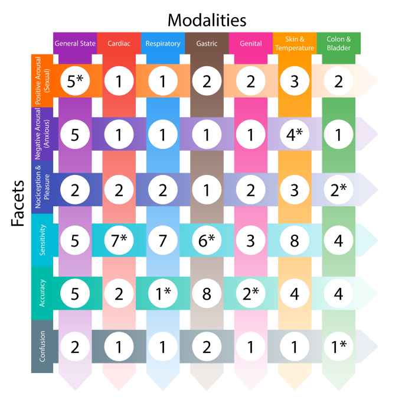
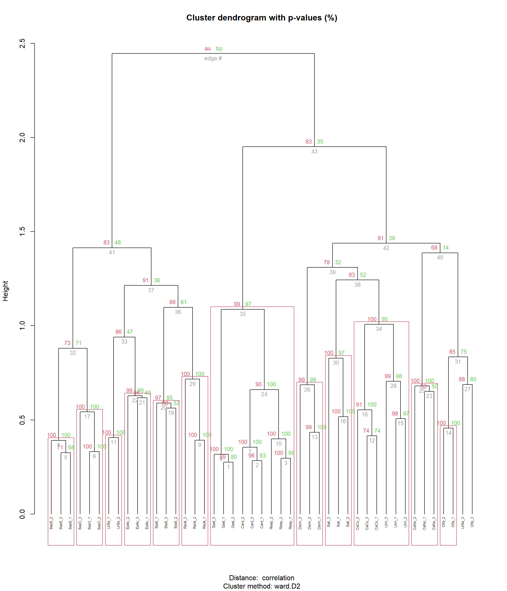

---
authors:
- roisin-sharma, oliver-collins
categories:
- Reality Bending Lab
- University of Sussex
date: "2025-10-01"
image:
  caption: ""
  placement: 0
title: "What is the Best Interoception Scale?"
summary: "Mint Scale"
tags:
- Reality Bending Lab
- ReBeL
- University of Sussex
- Psychology
- Interoception
- Scales
- Mint Scale
- Self-Report Measures
---

Hello👋! We are [Róisín](https://realitybending.github.io/authors/roisin-sharma/) and [Oliver](https://realitybending.github.io/authors/oliver-collins/), two Psychology Placement students at ReBeL 🧙, and today we are going to be discussing the tricky topic of self-report interoception scales.

**Interoception**, essentially referring to one’s awareness of their internal bodily sensations, has been studied by scientists for over a century **[^1]**. However, existing definitions, theoretical considerations, and measures are often at odds with each other. This inconsistent conceptualisation of “interoception” has led to the development of various interoception measures, often based on differing philosophies, raising questions over a “**jingle fallacy**” of interoception scales. In terms of “subjective”, self-report scales - the focus of this blog - established measures include the **Multidimensional Assessment of Interoceptive Awareness (MAIA/MAIA-2)**, the **Body Perception Questionnaire (BPQ)**, and the **Interoceptive Accuracy Scale (IAS)**.

To rival these established interoception measures, in an exciting development, shortly we will introduce a 💚**refreshing**💚 measure called the **Mint Scale**! Irresistible pun out the way, we hope you will leave this page feeling as invested in interoceptive measurement as us!

## What have the other interoception scales done?

The **Body Perception Questionnaire (BPQ)** is one of the earliest interoception scales, originally built by Porges in 1993 **[^2]**. The target was the autonomic nervous system **[^3]**, because this innervates most of our soft organs and helps the brain and body communicate. Here's the issue: this questionnaire focuses on stress responses, so mainly seeks to find out about internal sensing when there are problems (e.g., 'tremor in my lips', 'general jitteriness' being two items for body awareness). This makes sense as we are, of course, more aware of our body when experiencing discomfort. The problem is this is only one context in which we perceive our body, so it's also important to find out about the other times we sense inwards. Interoception is a regular part of all of our lives: whether it be when we feel hungry, decide to put our jacket on or go on a jog; it is a sense we all use all the time. Context will be a key criticism that pervades this blog, because we believe interoceptive processes will differ and mean different things depending on the context in which they arise.

There is however a scale that accounts for body awareness in positive states- deriving from the work on emotional regulation and pain arose *drumroll 🥁 please* the **Multidimensional Assessment of Interoceptive Awareness (MAIA)**, and later the MAIA-2 with additional scales. This scale was created because Mehling et al (2012) **[^4]** believed western medicine focused too much on bodily awareness as a maladaptive trait, even though research was increasingly finding health benefits from a sense of embodiment, such as that gained from mindfulness exercises. This scale therefore sought to find out if therapies that aimed to increase bodily awareness, actually worked. We found it had good predictive power for general wellbeing, although mainly for meta-cognitive beliefs about one's body on dimensions that we argue are less "core" facets of interoception. This is why we wanted to focus more on what we consider the main facets of interoception in the Mint Scale, such as visceral sensitivity. Essentially, MAIA is not as directly about interoception as the Mint Scale. It also does not take context into account, an issue we also found in the following scale…

Next up, the relatively new **Interoceptive Accuracy Scale (IAS)** saw the removal of the dubious meta-cognitive constructs introduced in the MAIA(-2), and was designed to distinguish the effects of interoceptive *accuracy* from the usual interoceptive *attention* **[^5]** when making interoceptive judgements. Although the IAS has shown a correlation with objective interoception measures **[^6]** (somewhat rare for subjective interoception scales!), we believe that its items unfortunately neglect the **context** of individuals’ interoceptive capabilities. This is where the IAS was NOT explicitly created with the idea of context influencing interoception baked into its development, with, for example, virtually every question of the 21-item scale only focusing on a general, context-free phrasing (i.e., “I can always accurately perceive when…”) followed by an interoceptive phenomenon mostly without a circumstantial framework. We believe that such item development is problematic 😱 because it falls short of acknowledging the effects of interoception’s strong variable homeostatic and physiological influences (which hence includes deeply context-dependent sensory phenomena) and also consequently fails to challenge potential memory biases associated with particularly salient interoceptive experiences (e.g., in a context-free item, somebody who went for a run *yesterday* may report perceiving their heartbeat more accurately than if they had not been for a run in *a year*). Basically, we argue that, although focusing on accuracy may converge particularly well with existing objective measures, the contextual reference of interoception still matters!

## So, what does the Mint Scale do differently?

Developed here at ReBeL, the **Mint (Multimodal Interoception Questionnaire) Scale** was created with the intention of addressing the caveats of the established measures above by building on, and synthesising, this previous research. Fundamentally, the Mint takes a “**context-by-modality**” approach to item development, encompassing a wide range of (seven) **modalities** of interoceptive experience (not *just* cardio-respiratory sensations, and even includes a “general state” category) and the **contexts** in which these may differ (covering negative (*anxious*) and positive (*sexual*) arousal states). The Mint focuses on the “core” aspects of interoception (thus excluding meta-cognitive constructs) and also examines certain related **mechanisms** (e.g., accuracy, confusion). All of this shows just how comprehensive the Mint Scale really is! Here we will summarise what we found in our paper (Makowski et al., 2025 **[^7]**) while developing the Mint Scale.

<figure>
  
  <figcaption><i>A conceptual grid diagram from our paper showing the amount of each item in each category from the initial 120 items.</i>
  </figcaption>
</figure>

As this graph from our paper shows, the distinction between facets and modalities is an important one in our paper…

#### Modalities are the "***what***"

You could think of modalities as the different ways interoception can occur. As this is to do with internally sensing our body’s signal, we have included a range of locations in the body, as well as a general state to cover the integrated experience of sensing the whole body. 

#### Facets are the "***how***"

Facets are about the different aspects of the experience of interoception. As we have said, we wanted to highlight the importance of the context in which the bodily state arose, which is why this includes our positive (sexual arousal) and negative (anxious arousal) state. This also involved other aspects of how we perceive interoception.

On the topic of analytical techniques, we used cutting-edge psychometric network-based techniques instead of factor analysis to arrive at the final items included in the Mint Scale, which is very cool because it conceptualises each item like nodes in a network, and lines between them show their associations **[^8]**. This technique overcomes some of the issues of factor analysis, such as issues with estimating the optimal number of factors. 

In Study 1, we got participants to complete our initial 120 item Mint Scale. In Study 2, we got participants to complete our Mint Scale with some refinements from Study 1, alongside the scales we discussed earlier. What our network-based techniques basically do is take our data from participants, and show us how items *cluster* together into what we call "node communities", for us to see the most important items and how they relate to each other. These node communities are similar to dimensions- they may represent an underlying phenomenon, although unlike factor analysis, this method does not automatically assume this to be the case. 

Another lovely thing about our network-based method (called exploratory graph analysis, or EGA for short) is that it estimates higher-order clusters, meaning as well as showing us the lower-level, specific items that group together, it also groups these communities more abstractly, into overarching "metaclusters", which allows us to look at the network in a hierarchical structure. This means complex links can be identified, which is handy as we want to investigate interoception as a highly complex phenomenon that is *greater than the sum of its parts*, as they say. The metaclusters we identified were *Interoceptive Deficit*, *Interoceptive Awareness* and *Visceroception*. Just to give you an idea of what this looks like, here is a diagram from our analyses. 

<figure>
  
  <figcaption><i>The hierarchical clusters from our analyses 🧠.</i>
  </figcaption>
</figure>

We arrived at the final 33-item scale with 11 distinct facets and a stable hierarchical structure through numerous refinements in an iterative process. This means we went over the structure and removed items as necessary, until dimensions stayed the same across computational resamples of the data.

An important application of the Mint is that it can be utilised for measuring altered interoception across clinical contexts (e.g., ADHD, alexithymia), where it has demonstrated greater predictive power than the other three scales for most conditions tested!

*However*, it is important to acknowledge a few limitations of the Mint:
- It has yet to be tested with “objective” interoception measures;
- Perhaps a wider range of negative/positive contexts should be investigated, especially in regards to testing with clinical populations;
- Shorter versions are yet to be fully tested.

## To conclude...

So, to bring our discussion to a close, ReBeL’s *refreshing* (... sorry!) Mint Scale constitutes a theoretically robust and novel development to the awkward world of subjective interoception measurement. Most importantly, taking an innovative approach through our **modality-by-context** framework, underpinned by an EGA methodology, opens future research up to a deeper, more sophisticated understanding about the genuine variable nature of interoception.

Interoception research is still relatively new, which means there is still a lot more work to be done into each of its diverse dimensions. This is why ReBeL has created the Mint interoception scale. It is now imperative that we synthesise previous approaches, by building on shortcomings and previous findings, because, as we find out more about interoception, we learn how to effectively find out even more. With this in mind, we hope you'll consider using the Mint Scale!

If you are interested, you can find ReBeL’s preprint for the Mint Scale here: 

- [https://www.researchgate.net/publication/394890454_The_Mint_Scale_A_Fresh_Validation_of_the_Multimodal_Interoception_Questionnaire_and_Comparison_to_the_MAIA_BPQ_and_IAS](https://www.researchgate.net/publication/394890454_The_Mint_Scale_A_Fresh_Validation_of_the_Multimodal_Interoception_Questionnaire_and_Comparison_to_the_MAIA_BPQ_and_IAS)

## Glossary

- **Jingle fallacy** = a shared label making different things appear to be more synonymous than they are. In the context of interoception, it can be argued that previous scales have measured distinct constructs/facets all under the label of “interoception”, which could thus be a misnomer.
- **Meta-cognitive beliefs** = our self-awareness of our own beliefs- including how we regulates our thoughts, which relates to emotions. These have implications into what coping strategies we may use. 
- **Visceral sensitivity** = sensitivity of sensation in internal organs in the main body cavities.
- **Predictive power** = a variable’s ability to forecast another separate variable.
- **Dimensions** = the underlying thing that the questionnaire items are designed to measure.
- **Latent** = the thing that underlies what we are measuring. We change latent variables into things we can measure to test them. For example, visceroception cannot be studied as a whole, but our individual items relating to it can inform us about it.

## Footnotes

[^1]: Sherrington C. S. (1906). The integrative action of the nervous system. Yale University Press.
[^2]: Porges, S. W. (1993). Body Perception Questionnaire. Umd.edu. [https://terpconnect.umd.edu/~sporges/body/body.txt](https://terpconnect.umd.edu/~sporges/body/body.txt)
[^3]: Kolacz, J., Holmes, L., & Porges, S. W. (2018). Body perception questionnaire (BPQ) manual. Traumatic Stress Research Consortium.
[^4]: Mehling, Price, Daubenmier, Acree, Bartmess, & Stewart. (2012). The Multidimensional Assessment of Interoceptive Awareness (MAIA). Plos One, 7(11). [https://doi.org/10.1371/journal.pone.0048230.g001](https://doi.org/10.1371/journal.pone.0048230.g001)
[^5]: Interoceptive attention is the degree of attentiveness towards a detected internal signal, with interoceptive accuracy referring to the correctness of one’s perception of an internal signal. It has been suggested that these two constructs are distinct aspects of interoception, which raises theoretical questions over what “interoception” really is and how it should consequently be measured, illustrating the previous point about the present inconsistent conceptualisation of interoception.
[^6]: Murphy, J., Brewer, R., Plans, D., Khalsa, S. S., Catmur, C., & Bird, G. (2019). Testing the independence of self-reported interoceptive accuracy and attention. Quarterly Journal of Experimental Psychology, 73(1), 115-133. [https://doi-org.sussex.idm.oclc.org/10.1177/1747021819879826](https://doi-org.sussex.idm.oclc.org/10.1177/1747021819879826)
[^7]: Makowski, D., Neves, A., Benn, E., Bennett, M., & Poerio, G. (2025). The Mint Scale: A Fresh Validation of the Multimodal Interoception Questionnaire and Comparison to the MAIA, BPQ and IAS. [https://doi.org/10.31234/osf.io/8qrht_v1](https://doi.org/10.31234/osf.io/8qrht_v1)

[^8]: Golino, H. F., & Epskamp, S. (2017). Exploratory graph analysis: A new approach for estimating the number of dimensions in psychological research. PLOS ONE, 12(6), e0174035. [https://doi.org/10.1371/journal.pone.0174035](https://doi.org/10.1371/journal.pone.0174035)
