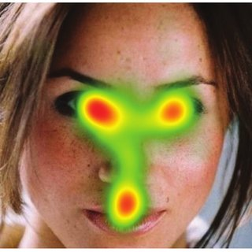

---
# An instance of the Blank widget.
# Documentation: https://wowchemy.com/docs/page-builder/
widget: blank

# Activate this widget? true/false
active: true

# This file represents a page section.
headless: true

# Order that this section appears on the page.
weight: 15

title: "**Participate in our research**"
subtitle: "*See how our experiments look like and contribute to science*"

design:
  columns: "1"
  spacing:
    padding: ["20px", "0", "20px", "0"]
  background:
    gradient_start: '#7986CB'
    gradient_end: '#BA68C8'
---

<table style="width:100%; border-collapse: collapse;" class="custom-table">
    <tr style="background-color: #F5F5F5;">
        <td style="width: 70%;">
            <b>How do  you look at AI-generated faces?</b> 
            ~30min; Need to have a webcam 👉
            <a href="https://realitybending.github.io/FakeFace2/experiment/index?exp=website"><b>Participate!</b></a>
        </td>
        <td style="width: 30%;">
            
        </td>
    </tr>
    <!-- <tr style="background-color: #F5F5F5;">
        <td style="width: 70%;">
            <b>Are you aroused by AI-generated erotic content?</b> 
            ~20min; > 18 years old 👉
            <a href="https://realitybending.github.io/FictionEro/experiment/english?exp=website&lang=en"><b>Participate!</b></a>
        </td>
        <td style="width: 30%;">
            
        </td>
    </tr> -->
    <tr style="background-color: #EEEEEE;">
        <td style="width: 70%;">
            <b>Can you resist Visual Illusions?</b> 
            ~35min 👉
            <a href="https://realitybending.github.io/IllusionGameSuggestibility/experiment/index?exp=website"><b>Participate!</b></a>
        </td>
        <td style="width: 30%;">
            
        </td>
    </tr>
</table>
